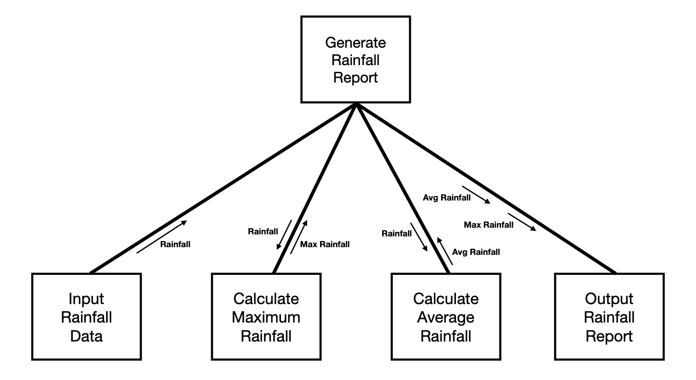

# Midterm Review

##  Software Design
Software Design - Definition, the two types of design (so far), where they come from, what they are concerned with

**There are many definitions**
* The process of defining software methods, functions, objects, and overall structure and interaction of your code so that the resulting functionality will satisfy user requirements.

**Two layers of design**
#### *Structured design*
- From structured programming

#### *Object-oriented design*
- From object-oriented programming  
---
## Software Design Characteristics
- Might need to know stuff about each..? I hope not

* Compatibility
* Fault-tolerance
* Reliability
* Usability
* Performance
* Scalability
* Robustness
* Extensibility
* Modularity
* Maintainability
* Reusability
* Security

---
## Algorithmic Decomposition  

Decomposition:
Breaking a complex problem or system into a collection of smaller parts  
**A lower-level approach is needed for OOP**  
<mark>Algorithmic Decomposition</mark>:
Breaking a complex *algorithm* into a collection of smaller algorithms  
**How?**  
> Start with the initial algorithm and apply algorithm decomposition recursively  
With good design, smaller algorithms improve *modularity* which improves *maintainabiltiy* and *reusability*  
Possible tradeoff: *efficiency*  

 
Rainfall: Algorithmic Decomposition
1. Input rainfall data
1. Calculate maximum rainfall
1. Calculate average rainfall
1. Output the rainfall report
---
## Structure Diagram

### check slide 7 + of algorithmic decomposition (add more)
---
## Coding Standards  
### Coding Style
- Given a function declaration or definition, imporve the code using the principles we discussed in class. Proper parameter passing (will touch up on this)

- Code is the only documentation of the design often times  

**Essential Parts of Coding Style:**
- Indentation: "flow of control"
- Newlines
- Whitespace
- Comments: prefer line comments unless multiple lines, doxygen comments when appropriate (more to come)
- Naming conventions

**Characteristics of a Coding Style**
- Consistency
- Scability
- Maintainability  

**example**
### Inconsistent, not scalable, not maintainable

    auto value=*begin; // pivot value is the first element

	auto left = begin;
	auto right= std::prev(end);
	while (std::distance(left,right)>0) {

		// move left-to-right while value is greater than elements
		while(value>= *left && std::distance(left, end) > 0){
		   if (std::next(left) == end)
			    break;

			left=std::next(left);
		  }

		// move right-to-left while value is less than elements
		while (value <*right)
		{
			right= std::prev(right);
		}
		
	// exchange so elements less than value are on the left
	// and elements greater than value are on the right
		std::swap(*left, *right);
	}

	
	std::swap(*begin,*right); // exchange pivot and final location
    
      assert(std::all_of(begin, right, [right](int n){ return n <= *right; }));
      assert(std::all_of(right, end,   [right](int n){ return n >= *right; }));`

*This code has **inconsistency** and **scalability** problems*
- the assert statements at the bottom are not in line with the auto and the while loop
- be consistent with the comments, either have them on the line before or the same line, this is violated
- spacing errors within the while loop (will be seen in the correct version soon)

**corrected:**
### **Consistent, Scalable, Maintainable**

    // pivot value is the first element
    auto value = *begin;

    auto left = begin;
    auto right = std::prev(end);
    while (std::distance(left, right) > 0) {

        // move left-to-right while value is greater than elements
        while (value >= *left && std::distance(left, end) > 0) {
            if (std::next(left) == end)
                break;
            left = std::next(left);
        }

        // move right-to-left while value is less than elements
        while (value < *right) {
            right = std::prev(right);
        }
        
        // exchange so elements less than value are on the left
        // and elements greater than value are on the right
        std::swap(*left, *right);
    }

    // exchange pivot and final location
    std::swap(*begin, *right);

    // post-condition
    assert(std::all_of(begin, right, [right](int n){ return n <= *right; }));
    assert(std::all_of(right, end,   [right](int n){ return n >= *right; }));


* Consistent & clear comments, indentation, spacing
* No unnecessary new lines
* Closing braces are in line correctly and the opening { is placed on the same line, etc.
---
## Function Design
- Given a description, create a function declaration with a proper Doxygen-style comment. Parameter passing **must** follow the coding-style rules. Similar to the Utilties exercise.
```
/*
    Average of two numbers
    @param[in] n1 First input value
    @param[in] n2 Second input value
    @return Average of n1 and n2
*/
double avg(int& n1, int& n2);
```
```
/*
    Limit the range of values within a vector 
    @param[in, out] v1 Vector to be modified
    @param[in] low The lower bound of the range
    @param[in] high The upper bound of the range
    @return Vector with ranged values 
*/
std::vector<int> limit(std::vector<int>& v1, int& low, int& high);
```
**note**: unsure if my parameters are correct for the `std::vector<int> limit(std::vector<int>& v1, int& low, int& high);`  

--- 
### Parameters

| Direction   | Primitive    | Object        |
|-------------|--------------|---------------|
| IN          | `T`          | `const T&`    |
| OUT, IN/OUT | `T&`         | `T&`          |  

**Examples:**  
```cpp
int n;
const std::string& s;
int& total;
std::string& palindrome;
```

More on this: https://mlcollard.net/CPSC421S24/guides/Coding-Standard.html

---
## Generalizing Functions

* Referring to making functions applicable to more situations
* Very related to *concerns*
* Have to not make assumptions (okay lowkey there is a lot to talkl about here so might just have to go to the notes)
*https://mlcollard.net/CPSC421S24/notes/Generalizing-Functions.html?section=020&index=CPSC421-020S24#/*

---
## Physical Organziation

* Include guards  
* Header comments
* function comments
* separate function declarations and definitions


| Type              | Purpose             | Extension | Example       | Roles                  |
|-------------------|---------------------|-----------|---------------|------------------------|
| Include File      | Function declarations | .hpp      | Aggregate.hpp | interface concerns     |
| Implementation File | Function definitions | .cpp      | Aggregate.cpp | implementation concerns |

Separate Functions
```cpp  
/*
    Label.cpp
    Implementation file for label functions.
*/

#include "Label.hpp"
#include "pdfgen.h"

// output the label
void outputLabel(std::string_view label) {

    struct pdf_info info = {
        .creator = "My software",
        .producer = "My software",
        .title = "My document",
        .author = "My name",
        .subject = "My subject",
        .date = "Today"
    };
    struct pdf_doc *pdf = pdf_create(PDF_A4_WIDTH, PDF_A4_HEIGHT, &info);
    pdf_set_font(pdf, "Times-Roman");
    pdf_append_page(pdf);
    pdf_add_text(pdf, NULL, label.data(), 12, 50, 20, PDF_BLACK);
    pdf_save(pdf, "output.pdf");
    pdf_destroy(pdf);
}
```
```cpp

/*
    Label.hpp
    Include file for label functions.
*/

#ifndef INCLUDED_LABEL_HPP
#define INCLUDED_LABEL_HPP

#include <string_view>

// output the label
void outputLabel(std::string_view label);

#endif
```
Various one line comments for functions
Words to **NOT** have in function comments:  

> - function
> - method
> - variable
> - field
> - integer
> - long
> - double
> - object
> - integers
> - variables
> - contains
> - scalable
> - reusable
> - pass


```cpp
// Update the value at a pointer if the pointer is not null
void updateValue(int* valuePtr, int newValue);

// Add a value to each element
void addToElements(std::vector<int>& vec, int valueToAdd);

// Concatenate two strings
std::string concatenate(std::string_view s1, std::string_view s2);

// Determine if two strings are equal
bool equal(std::string_view s1, std::string_view s2);

// Print a message to the console a specific number of times
void printMessageNTimes(std::string_view message, int nTimes);

// Area of a rectangle
double rectangleArea(double length, double width);

// Determine if a number is even
bool isEven(int number);

// Swap the values of two integers
void swap(int& a, int& b);
```
#### IWYU
**I**nclude **W**hat **Y**ou **U**se  
Include any needed files for .cpp and/or .hpp

---

## Naming & Method Naming Standards
Correct poor names in given list  
**Functions are *actions***
* camelCase, under_score  
~~`getfullName();`~~  
`getFullName();`  
`garbage_collection();`  
`check_static_allocation_size();`


* Correct grammatical structure  
~~`managedResourceRegister();`~~  bad structure  
`registerManagedResource();`  
`// verb phrase`  
`drawContentBorder();`  
`// verb phrase with a prepositional phrase();`  
`performTestsFromZipFile();`  
`// noun phrase`  
`nextArea();`  

---  
## Iterators  
Iterators tie data structures and algorithms together  
**Gang of Four (GoF)**  
```cpp
// Iterator for a container with elements of type T
interface Iterator {
    // Restart iteration
    void First(); 
    // Advance to next item
    void Next();
    // Are we done yet?
    bool IsDone();
    // Get current item
    T CurrentItem();
}
```  
Forward Iteration Only
1. Restart iteration
1. Advance to next item
1. Are we done yet?
1. Get current item
```cpp  
    const int ARSIZE = 5;
    int ar[ARSIZE] = { 5, 3, 2, 1, 6 };

    // output ar with each value on its own line
    for (int* p = ar; p < ar + ARSIZE; ++p)
        std::cout << *p << '\n';
```  
| C-Array Pointers | Description               | C++ Iterator Term |
|------------------|---------------------------|-------------------|
| `int* p = ar;`   | Start at the beginning   | *initialize*      |
| `++p`            | Advance to the next item | *increment*       |
| `p < ar + ARSIZE`| Keep going?              | *comparison*      |
| `*p`             | Get current item         | *dereference*     |

**Use ++p(pre-increment) instead of p++(post-increment)**  
**Use --p(post-decrement) instead of p--(post-decrement)**  

---  
## Free-Function Stereotypes  

* Mutator::command  
* Accessor::property  
* Accessor::predicate 

### Mutator::command 
```cpp  
void order(int&, int&);

void sort(std::vector<int>& v);

void sort(std::vector<int>::iterator begin,
          std::vector<int>::iterator end);

void remove(std::vector<int>& v,
            int value);
```

- Executes a change based on the IN/OUT parameters  
- For data the function *changes*, parameters are *IN/OUT or OUT*  
- These parameters are *pass by reference* (**not** pass by const reference)    
- Other parameters may be IN  

### Accessor::property  
```cpp  
int average(int, int);

double pay(int hours, double rate);

std::vector<int>::const_iterator search(
    const std::vector<int>& v,
    int value);

std::vector<int>::const_iterator search(
    std::vector<int>::const_iterator begin,
    std::vector<int>::const_iterator end,
    int value);
```  
- Returns information derived from the IN parameters
- Parameters are *pass by value* or *pass by const reference*
- When iterators are used, *pass by value of const_iterator*

### Accessr::predicate
```cpp  
bool isValidFilename(std::string_view filename);

bool isStartTag(std::string::const_iterator cursor);

bool contains(const std::vector<double>& v,
              double value);

bool contains(
    std::vector<double>::const_iterator begin,
    std::vector<double>::const_iterator end
    double value);
```

- Returns a Boolean result derived from the IN parameter  
- Parameters are **all** *IN*  
- Must pass all data directly used in the condition  
- Useful for even short conditions as it gives them a name  
- Often extracted from code with complex conditional statements:  `
if (content[1] == '!' /* && content[0] == '<' */ && 
    content[2] == '[' && content[3] == 'C' && 
    content[4] == 'D' && content[5] == 'A' && 
    content[6] == 'T' && content[7] == 'A' && 
    content[8] == '[') {
}`  
- Want to hide the details on how the predicate is determined so we keep these in here  
- If not a standard term, then verb form often starts with *is*, but can also be *has* etc. (all verbs)  
* Standard Terms  
empty  
contains  

---  
## Concerns
Concern:
particular set of information that affects the code of a computer program
**We want to:**
- *Identify* concerns  
- *Separate* concerns  


## XML  
Know what is and what is not an XML concern
- Part of data in an executable program  
- Containers: *std::vector, std::list, std::array, c-array*  
- Objects: struct, class  
- Database  
**XML Interface Concepts**  

| Concept               | Attributes                              | Notes                               |
|-----------------------|-----------------------------------------|-------------------------------------|
| Start Document        |                                         | Occurs before parsing               |
| XML Declaration      | *version*, *encoding*, *standalone*    | Occurs once before the root         |
| Element Start Tag    | *qName*, *prefix*, *localName*         |                                     |
| Element End Tag      | *qName*, *prefix*, *localName*         |                                     |
| Characters            | *characters*                           | Includes entity references          |
| Attribute             | *qName*, *prefix*, *localName*, *value*|                                     |
| XML Namespace        | *prefix*, *uri*                        |                                     |
| XML Comment           | *value*                                |                                     |
| CDATA                | *characters*                           | Somewhat rare, and not in our data |
| Processing Instruction | *target*, *data*                       | Rare, and not in our data           |
| End Document          |                                         | Occurs after parsing                |

## UML Class Diagrams  
  

---  

* A static, structure diagram  
* Name  
* Attributes - data members/fields  
* *perations - methods/member functions  

**Visibility**
- `+` public  
- `-` private  
- `#` protected  
- `~` package  
### Model to Code: Forward Engineering  
  
↓↓↓↓↓↓↓↓↓↓  
```cpp  
class YAMLParser {
public:
    static bool isKey(/* ... */);
    static void parseKey(/* ... */);
    static bool isValue(/* ... */);
    static void parseValue(/* ... */);
}
```  

### Code to Model: Reverse Engineering  
```cpp
class Student {
public:
    // constructor
    Student(const Name& name);

    // name accessor
    const Name& getName() const;

    // name mutator
    void setName(const Name& name);

private:    
    Name name;
};
```  
↓↓↓↓↓↓↓↓↓↓  
  

## Organizing Functions  
free functions in a file, in a namespace, and as static methods of a class  

### Free functions
A function that is not a member of a class  
- Useful for algorithms performed on the parameters  
- All IN data is from a value or const reference parameter  
- All OUT data is from a reference parameter or the return value  
- Does not save state between calls  
- Typically group (or organized) by file, e.g., xml_parser.hpp  

When there are multiple functions creating conflicting names, can put prefixes infront to specify like so: 
- Prior to prefixes:
    ```cpp
        // pdf_parser.hpp
        std::string parse(std::string_view filename);
        // yaml_parser.hpp
        std::string parse(std::string_view filename);
      ```

```cpp
// pdf_parser.hpp
std::string pdf_parse(std::string_view filename);

// yaml_parser.hpp
std::string yaml_parse(std::string_view filename);

// main.cpp
#include <iostream>
#include <string>
#include <filesystem>
#include <pdf_parser.hpp>
#include <yaml_parser.hpp>

int main(int argc, char* argv[]) {

    std::filesystem::path filePath(argv[1]);

    // parse the input depending on the file type   
    if (filePath.extension() == '.pdf') {
        // parse pdf file
        std::cout << pdf_parse(argv[1]) << '\n';
    } else {
        // parse yaml file
        std::cout << yaml_parse(argv[1]) << '\n';
    }   
    
    return 0;
}
// pdf_parser.hpp
std::string pdf_parse(std::string_view filename);

// yaml_parser.hpp
std::string yaml_parse(std::string_view filename);

// main.cpp
#include <iostream>
#include <string>
#include <filesystem>
#include <pdf_parser.hpp>
#include <yaml_parser.hpp>

int main(int argc, char* argv[]) {

    std::filesystem::path filePath(argv[1]);

    // parse the input depending on the file type   
    if (filePath.extension() == '.pdf') {
        // parse pdf file
        std::cout << pdf_parse(argv[1]) << '\n';
    } else {
        // parse yaml file
        std::cout << yaml_parse(argv[1]) << '\n';
    }   
    
    return 0;
}
```
### Namespaces  
But a better way is using namespaces:
-  A language feature to group functions and provide an organizing name
* Can contain:  
free functions  
variables  
classes  
typedef  

```cpp
// pdf_parser.h
namespace PDFParser {
    std::string parse(std::string_view filename);
}

// yaml_parser.h
namespace YAMLParser {
    std::string parse(std::string_view filename);
}

// main.cpp
#include <iostream>
#include <string>
#include <filesystem>
#include <pdf_parser.hpp>
#include <yaml_parser.hpp>

int main(int argc, char* argv[]) {

    std::filesystem::path filePath(argv[1]);

    // parse the input depending on the file type   
    if (filePath.extension() == '.pdf') {
        // parse pdf file
        std::cout << PDFParser::parse(argv[1]) << '\n';
    } else {
        // parse yaml file
        std::cout << YAMLParser::parse(argv[1]) << '\n';
    }   
    
    return 0;
}
```  
### Static Method  
- static class methods do not have access to data members/fields  
- They do have access to static data members/fields  
- No advantage over namespaces, except that it may be joined with non-static member functions  
```cpp
class PDFParser {
public:
    static std::string parse(std::string_view filename);
};

class YAMLParser {
public:
    static std::string parse(std::string_view filename);
};
```


## Cohesion
Cohesion:
Degree of connectivity among the elements of a single module and in object-oriented design, a single class/object

Goal of *cohesion* is to maximize internal interaction (intramural) among subelements

**Types of Cohesion** (don't need to know rlly)  
* *Informational* (best)  
* *Functional* (best)  
* *Sequential* (better)  
* *Communicational* (better)  
* *Procedural*  
* *Temporal*  
* *Logical*  
* *Coincidental* (worst)  


## Encapsulation and Information Hiding  
Encapsulation is not information hiding, but it was adapted from information hiding  
| Access Type | Visibility                        |
|-------------|----------------------------------|
| `public`    | All code                          |
| `protected` | `class A` methods                 |
|             | friend functions of `class A`     |
|             | `class` derived from `class A`    |
| `private`   | `class A` methods                 |
|             | friend functions s of `class A`   |  

### Encapsulation  
*The bundling of data with the methods that operate on that data*  
### Information Hiding  
*Hide the internal representation, or state, of an object from the outside*  

---
### Encapsulation Rule  
- Place data and the operations that perform on that data in the same class
    - Don't make the client tie data and operations together  
    - Provide it in one class (or the fewest number of classes needed)  
    - Improves the class cohesion  

### Information Hiding Rules

1. Don't expose data items
1. Don't expose the difference between stored data and derived data  
    - Use get method names for property names  
get method names: `speed()`, `getSpeed()`  
property method names:  
  ~~`calculateS`~~`speed()`, ~~`determineS`~~`speed()`  
3. Don't expose implementation details of a class
1. Don't expose a class's internal structure


### Member Initialization List

Order of field creation, proper use of member initialization list
```cpp
class A {
public:
    A()
        : b(0), b2(1)
    {}

private:
    B b;
    B2 b2;
};
```
- Part of the constructor  
- Often ignored until after it is needed  
- The only way that we can control what constructor is called for the fields of the class  
- Syntax is a little strange but necessary  

Constructors are called in the order they appear in the class definition